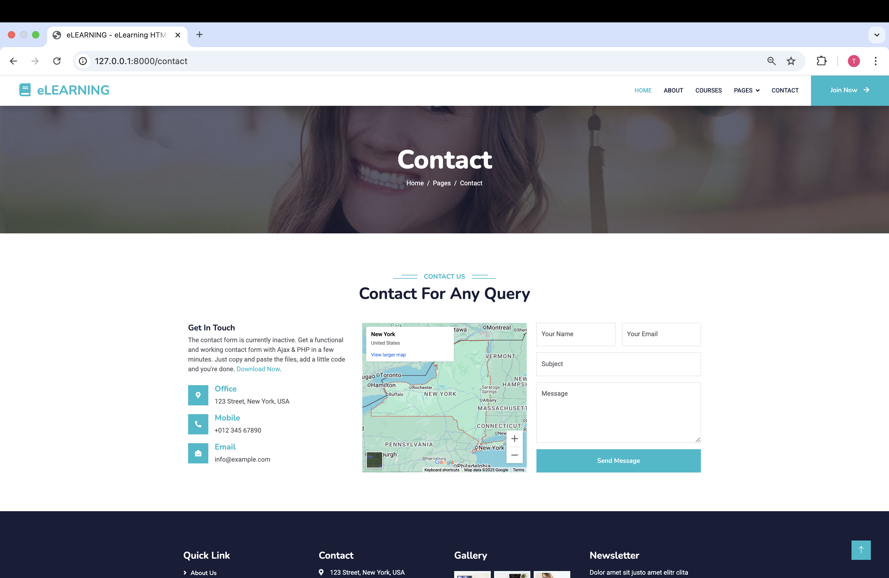
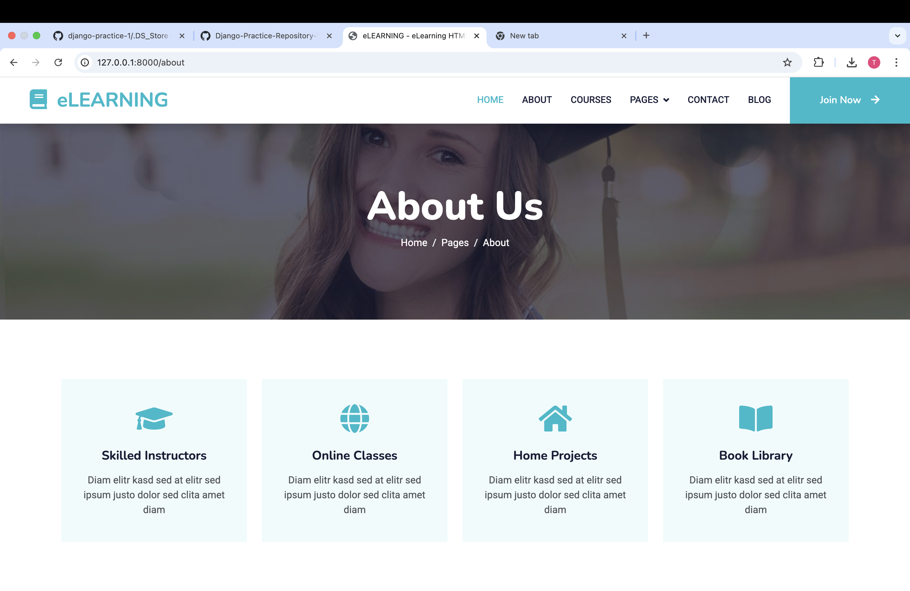
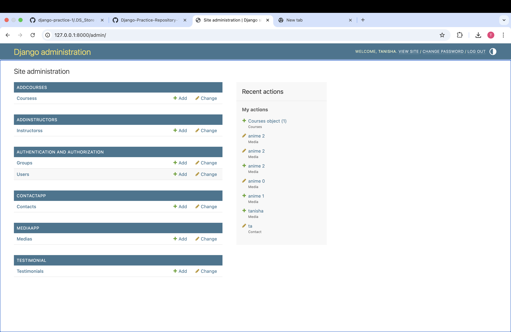

📘 Django Practice Repository – REST APIs, SMTP Email, Authentication & More

REPO - Django-Practice-/1

This repository is a complete Django practice project where you learn and implement real-world backend features such as:

✔ REST API creation
✔ API calling
✔ SMTP email sending
✔ User authentication
✔ CRUD operations
✔ Working with Postman
✔ Admin panel customization
✔ Project structure & environment variables

This project is ideal for students and developers who want to practice Django by building real modules step-by-step.

🌟 Features Included
✔ REST API Development
Create APIs (GET, POST, PUT, DELETE)
DRF Serializers (if used)
JSON-based response handling

✔ API Calling
Use Python requests to call external APIs
Parse JSON
Error handling

✔ SMTP Email Sending
Gmail SMTP or custom SMTP
welcome email, custom HTML emails
Email service module

✔ Authentication System
Register / Login
Session-based auth
Custom user flow

✔ CRUD Operations
Create, Edit, Delete records
Forms + validation
Pagination & search (optional)

✔ Django Admin & Utilities
Admin customization
Model filters, search fields
Environment variables support

🛠 Tech Stack
Python
Django
Django REST Framework (optional)
SQLite / PostgreSQL
HTML, CSS, Bootstrap
SMTP
Postman (API testing)

📁 Project Structure

├── addCourses
│   ├── __init__.py
│   ├── __pycache__
│   │   ├── __init__.cpython-311.pyc
│   │   ├── admin.cpython-311.pyc
│   │   ├── apps.cpython-311.pyc
│   │   └── models.cpython-311.pyc
│   ├── admin.py
│   ├── apps.py
│   ├── migrations
│   │   ├── __init__.py
│   │   ├── __pycache__
│   │   │   ├── __init__.cpython-311.pyc
│   │   │   └── 0001_initial.cpython-311.pyc
│   │   └── 0001_initial.py
│   ├── models.py
│   ├── tests.py
│   └── views.py
├── addInstructors
│   ├── __init__.py
│   ├── __pycache__
│   │   ├── __init__.cpython-311.pyc
│   │   ├── admin.cpython-311.pyc
│   │   ├── apps.cpython-311.pyc
│   │   └── models.cpython-311.pyc
│   ├── admin.py
│   ├── apps.py
│   ├── migrations
│   │   ├── __init__.py
│   │   ├── __pycache__
│   │   │   ├── __init__.cpython-311.pyc
│   │   │   └── 0001_initial.cpython-311.pyc
│   │   └── 0001_initial.py
│   ├── models.py
│   ├── tests.py
│   └── views.py
├── contactApp
│   ├── __init__.py
│   ├── __pycache__
│   │   ├── __init__.cpython-311.pyc
│   │   ├── __init__.cpython-313.pyc
│   │   ├── admin.cpython-311.pyc
│   │   ├── admin.cpython-313.pyc
│   │   ├── apps.cpython-311.pyc
│   │   ├── apps.cpython-313.pyc
│   │   ├── models.cpython-311.pyc
│   │   └── models.cpython-313.pyc
│   ├── admin.py
│   ├── apps.py
│   ├── migrations
│   │   ├── __init__.py
│   │   ├── __pycache__
│   │   │   ├── __init__.cpython-311.pyc
│   │   │   ├── __init__.cpython-313.pyc
│   │   │   ├── 0001_initial.cpython-311.pyc
│   │   │   └── 0001_initial.cpython-313.pyc
│   │   └── 0001_initial.py
│   ├── models.py
│   ├── tests.py
│   └── views.py
├── db.sqlite3
├── manage.py
├── media
│   ├── course_images
│   │   └── course-1.jpg
│   ├── media
│   │   ├── angery.jpg
│   │   ├── anime1.jpg
│   │   ├── fake_baby_ql41f6n.png
│   │   ├── fake_baby.png
│   │   └── Safebooru.jpeg
│   └── media_files
│       └── fake_baby.png
├── mediaApp
│   ├── __init__.py
│   ├── __pycache__
│   │   ├── __init__.cpython-311.pyc
│   │   ├── __init__.cpython-313.pyc
│   │   ├── admin.cpython-311.pyc
│   │   ├── admin.cpython-313.pyc
│   │   ├── apps.cpython-311.pyc
│   │   ├── apps.cpython-313.pyc
│   │   ├── models.cpython-311.pyc
│   │   └── models.cpython-313.pyc
│   ├── admin.py
│   ├── apps.py
│   ├── migrations
│   │   ├── __init__.py
│   │   ├── __pycache__
│   │   │   ├── __init__.cpython-311.pyc
│   │   │   ├── __init__.cpython-313.pyc
│   │   │   ├── 0001_initial.cpython-311.pyc
│   │   │   ├── 0001_initial.cpython-313.pyc
│   │   │   ├── 0002_alter_media_image.cpython-311.pyc
│   │   │   └── 0002_alter_media_image.cpython-313.pyc
│   │   ├── 0001_initial.py
│   │   └── 0002_alter_media_image.py
│   ├── models.py
│   ├── tests.py
│   └── views.py
├── README.md
├── static
│   ├── css
│   │   ├── bootstrap.min.css
│   │   └── style.css
│   ├── elearning-html-template.jpg
│   ├── img
│   │   ├── about.jpg
│   │   ├── carousel-1.jpg
│   │   ├── carousel-2.jpg
│   │   ├── cat-1.jpg
│   │   ├── cat-2.jpg
│   │   ├── cat-3.jpg
│   │   ├── cat-4.jpg
│   │   ├── course-1.jpg
│   │   ├── course-2.jpg
│   │   ├── course-3.jpg
│   │   ├── screenshots
│   │   │   ├── about.png
│   │   │   ├── admin.png
│   │   │   ├── api-calling.png
│   │   │   ├── contact.png
│   │   │   ├── course.png
│   │   │   ├── error.png
│   │   │   └── home.png
│   │   ├── team-1.jpg
│   │   ├── team-2.jpg
│   │   ├── team-3.jpg
│   │   ├── team-4.jpg
│   │   ├── testimonial-1.jpg
│   │   ├── testimonial-2.jpg
│   │   ├── testimonial-3.jpg
│   │   └── testimonial-4.jpg
│   ├── js
│   │   └── main.js
│   ├── lib
│   │   ├── animate
│   │   │   ├── animate.css
│   │   │   └── animate.min.css
│   │   ├── easing
│   │   │   ├── easing.js
│   │   │   └── easing.min.js
│   │   ├── owlcarousel
│   │   │   ├── assets
│   │   │   │   ├── ajax-loader.gif
│   │   │   │   ├── owl.carousel.css
│   │   │   │   ├── owl.carousel.min.css
│   │   │   │   ├── owl.theme.default.css
│   │   │   │   ├── owl.theme.default.min.css
│   │   │   │   ├── owl.theme.green.css
│   │   │   │   ├── owl.theme.green.min.css
│   │   │   │   └── owl.video.play.png
│   │   │   ├── LICENSE
│   │   │   ├── owl.carousel.js
│   │   │   └── owl.carousel.min.js
│   │   ├── waypoints
│   │   │   ├── links.php
│   │   │   └── waypoints.min.js
│   │   └── wow
│   │       ├── wow.js
│   │       └── wow.min.js
│   ├── LICENSE.txt
│   ├── READ-ME.txt
│   └── scss
│       ├── bootstrap
│       │   └── scss
│       │       ├── _accordion.scss
│       │       ├── _alert.scss
│       │       ├── _badge.scss
│       │       ├── _breadcrumb.scss
│       │       ├── _button-group.scss
│       │       ├── _buttons.scss
│       │       ├── _card.scss
│       │       ├── _carousel.scss
│       │       ├── _close.scss
│       │       ├── _containers.scss
│       │       ├── _dropdown.scss
│       │       ├── _forms.scss
│       │       ├── _functions.scss
│       │       ├── _grid.scss
│       │       ├── _helpers.scss
│       │       ├── _images.scss
│       │       ├── _list-group.scss
│       │       ├── _mixins.scss
│       │       ├── _modal.scss
│       │       ├── _nav.scss
│       │       ├── _navbar.scss
│       │       ├── _offcanvas.scss
│       │       ├── _pagination.scss
│       │       ├── _popover.scss
│       │       ├── _progress.scss
│       │       ├── _reboot.scss
│       │       ├── _root.scss
│       │       ├── _spinners.scss
│       │       ├── _tables.scss
│       │       ├── _toasts.scss
│       │       ├── _tooltip.scss
│       │       ├── _transitions.scss
│       │       ├── _type.scss
│       │       ├── _utilities.scss
│       │       ├── _variables.scss
│       │       ├── bootstrap-grid.scss
│       │       ├── bootstrap-reboot.scss
│       │       ├── bootstrap-utilities.scss
│       │       ├── bootstrap.scss
│       │       ├── forms
│       │       │   ├── _floating-labels.scss
│       │       │   ├── _form-check.scss
│       │       │   ├── _form-control.scss
│       │       │   ├── _form-range.scss
│       │       │   ├── _form-select.scss
│       │       │   ├── _form-text.scss
│       │       │   ├── _input-group.scss
│       │       │   ├── _labels.scss
│       │       │   └── _validation.scss
│       │       ├── helpers
│       │       │   ├── _clearfix.scss
│       │       │   ├── _colored-links.scss
│       │       │   ├── _position.scss
│       │       │   ├── _ratio.scss
│       │       │   ├── _stretched-link.scss
│       │       │   ├── _text-truncation.scss
│       │       │   └── _visually-hidden.scss
│       │       ├── mixins
│       │       │   ├── _alert.scss
│       │       │   ├── _border-radius.scss
│       │       │   ├── _box-shadow.scss
│       │       │   ├── _breakpoints.scss
│       │       │   ├── _buttons.scss
│       │       │   ├── _caret.scss
│       │       │   ├── _clearfix.scss
│       │       │   ├── _color-scheme.scss
│       │       │   ├── _container.scss
│       │       │   ├── _deprecate.scss
│       │       │   ├── _forms.scss
│       │       │   ├── _gradients.scss
│       │       │   ├── _grid.scss
│       │       │   ├── _image.scss
│       │       │   ├── _list-group.scss
│       │       │   ├── _lists.scss
│       │       │   ├── _pagination.scss
│       │       │   ├── _reset-text.scss
│       │       │   ├── _resize.scss
│       │       │   ├── _table-variants.scss
│       │       │   ├── _text-truncate.scss
│       │       │   ├── _transition.scss
│       │       │   ├── _utilities.scss
│       │       │   └── _visually-hidden.scss
│       │       ├── utilities
│       │       │   └── _api.scss
│       │       └── vendor
│       │           └── _rfs.scss
│       └── bootstrap.scss
├── tanisha
│   ├── __init__.py
│   ├── __pycache__
│   │   ├── __init__.cpython-311.pyc
│   │   ├── __init__.cpython-313.pyc
│   │   ├── settings.cpython-311.pyc
│   │   ├── settings.cpython-313.pyc
│   │   ├── urls.cpython-311.pyc
│   │   ├── urls.cpython-313.pyc
│   │   ├── views.cpython-311.pyc
│   │   ├── views.cpython-313.pyc
│   │   ├── wsgi.cpython-311.pyc
│   │   └── wsgi.cpython-313.pyc
│   ├── asgi.py
│   ├── settings.py
│   ├── urls.py
│   ├── views.py
│   └── wsgi.py
├── templates
│   ├── 404.html
│   ├── about.html
│   ├── base.html
│   ├── blog.html
│   ├── contact.html
│   ├── courses.html
│   ├── email_send.html
│   ├── index.html
│   ├── product.html
│   ├── team.html
│   └── testimonial.html
└── testimonial
    ├── __init__.py
    ├── __pycache__
    │   ├── __init__.cpython-311.pyc
    │   ├── admin.cpython-311.pyc
    │   ├── apps.cpython-311.pyc
    │   └── models.cpython-311.pyc
    ├── admin.py
    ├── apps.py
    ├── migrations
    │   ├── __init__.py
    │   ├── __pycache__
    │   │   ├── __init__.cpython-311.pyc
    │   │   └── 0001_initial.cpython-311.pyc
    │   └── 0001_initial.py
    ├── models.py
    ├── tests.py
    └── views.py

🚀 Installation Guide
1️⃣ Clone the Repository
git clone https://github.com/<username>/<repo-name>.git
cd <repo-name>

2️⃣ Create Virtual Environment
python -m venv venv
venv\Scripts\activate        # Windows
source venv/bin/activate     # macOS/Linux

3️⃣ Install Dependencies
pip install -r requirements.txt

4️⃣ Run Migrations
python manage.py migrate

5️⃣ Start Server
python manage.py runserver

📬 SMTP Configuration

Add to settings.py:

EMAIL_BACKEND = 'django.core.mail.backends.smtp.EmailBackend'
EMAIL_HOST = 'smtp.gmail.com'
EMAIL_PORT = 587
EMAIL_USE_TLS = True
EMAIL_HOST_USER = '<your-email>'
EMAIL_HOST_PASSWORD = '<your-app-password>'

📌 Future Enhancements
JWT Authentication
Role-based access
File upload API
Payment integration
Deployment (Render / Railway)
Caching & performance tuning

🔖 GitHub Tags (Use in Repo Settings)
django
django-practice
rest-api
smtp-email
django-learning
python-backend
django-tutorial
django-crud
api-development

🤝 Contribution
This is a learning project. Improve it, test new modules, and push updates freely.

📄 License
This project is open-source under MIT License.

📸 Screenshots (Optional)

You can upload screenshots inside /screenshots/ and display them like:
## 📸 Screenshots
### Homepage  

### Contact Page  

### About Page  

### API Test

### Admin Panel  

### Course Page  

### Error Page

